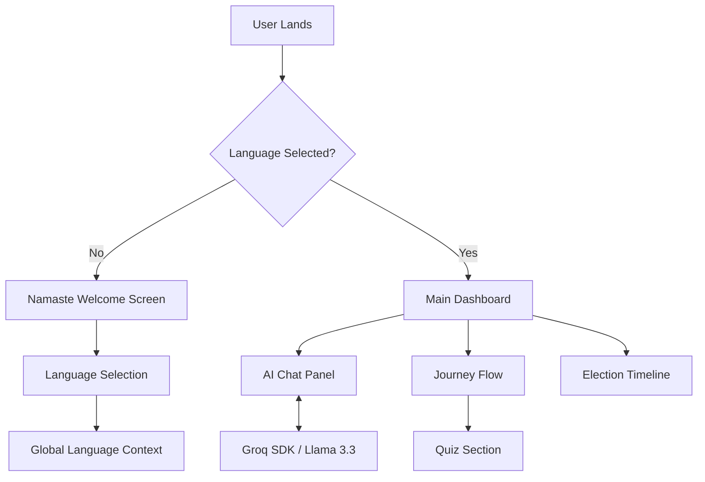
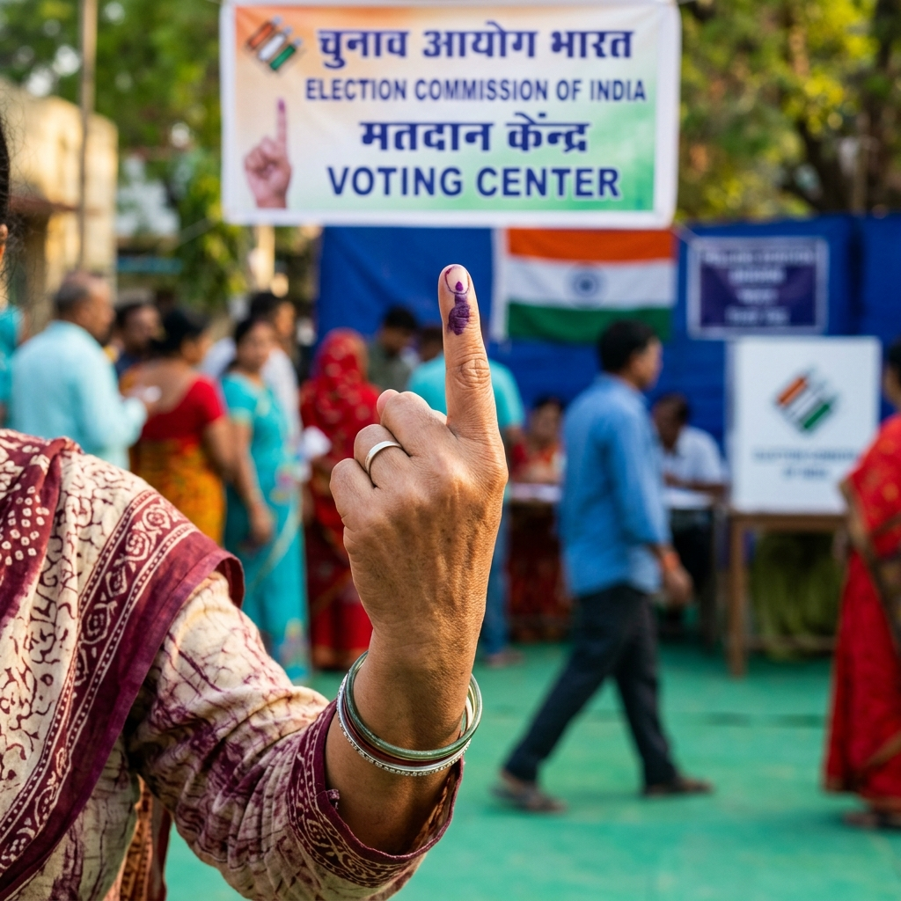
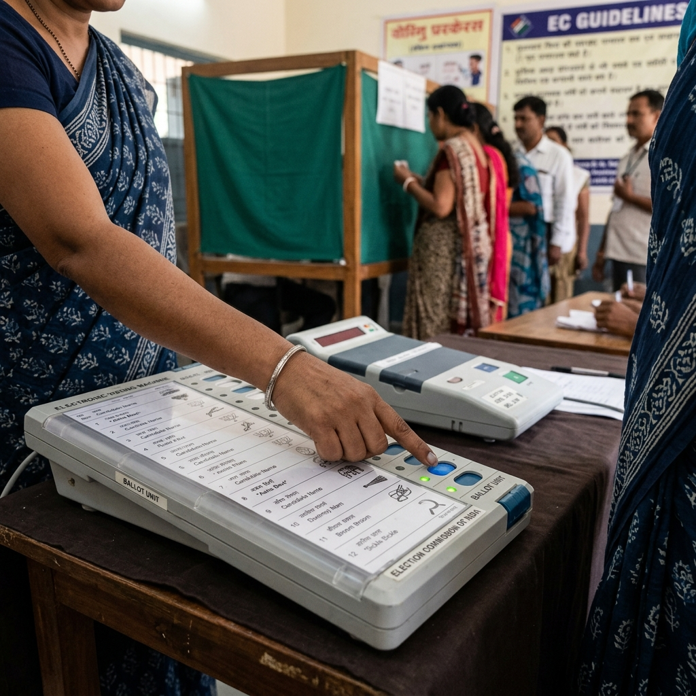

# 🗳️ VoteSaathi AI — Your Personal Voting Guide 🇮🇳

<div align="center">
  
  <p align="center">
    <b>Empowering 950 million voters with artificial intelligence and elegant design.</b>
  </p>
</div>

[](https://github.com/Dheer46/VoteSaathi/stargazers)
[](LICENSE)
[](https://nextjs.org/)
[](https://groq.com/)

---

## 🌟 The Vision

**VoteSaathi AI** is more than just a website; it's a digital companion for the world's largest democratic exercise. We believe that technology should bridge the gap between complex civic processes and the citizens they serve. 

Built with a **Luxury Editorial Aesthetic**, VoteSaathi combines the power of **Large Language Models** with a user-centric interface to ensure no voter is left behind due to language barriers or complex bureaucracy.

---

## 🚀 Experience the Journey

### 1. The Namaste Protocol
Every session begins with a warm welcome. Our signature "Namaste" screen allows users to immediately feel at home by selecting their native language, ensuring total inclusivity from the first second.

### 2. Intelligent AI Concierge
*   **Context-Aware:** Understands the nuances of Indian election laws.
*   **Multilingual:** Switch seamlessly between English, Hindi, and regional languages.
*   **Groq-Accelerated:** Near-instant response times for critical voting queries.

### 3. Interactive Civic Flow
We've distilled the voting process into a high-impact visual journey. Track your progress from electoral roll verification to the final inked finger.

### 4. Inclusive by Design
Our **Accessibility Panel** allows for real-time adjustments:
- 🌑 **High Contrast Mode** for visual clarity.
- 🔍 **Font Scaling** for readability.
- 🎙️ **Speech Integration** for an eyes-free experience.

---

## 🏗️ System Architecture



---

## 🛠️ Developer Setup

```bash
# 1. Clone & Enter
git clone https://github.com/Dheer46/VoteSaathi.git && cd VoteSaathi

# 2. Install dependencies
npm install

# 3. Secure your API Key
echo "GROQ_API_KEY=your_actual_key" > .env.local

# 4. Launch the experience
npm run dev
```

---

## 🖼️ Visual Gallery

<div align="center">
  <table border="0">
    <tr>
      <td><br/><p align="center"><i>Voter Journey</i></p></td>
      <td><br/><p align="center"><i>Election Pride</i></p></td>
    </tr>
    <tr>
      <td colspan="2"><br/><p align="center"><i>Electronic Voting Machine Guide</i></p></td>
    </tr>
  </table>
</div>

---

## 🤝 Contributing

We welcome contributions from developers, designers, and civic activists!
1. Fork the Project.
2. Create your Feature Branch (`git checkout -b feature/AmazingFeature`).
3. Commit your Changes (`git commit -m 'Add some AmazingFeature'`).
4. Push to the Branch (`git push origin feature/AmazingFeature`).
5. Open a Pull Request.

---

<div align="center">
  <p><b>VoteSaathi AI</b> — Empowering the Indian Voter.</p>
  <p><i>Design meets Democracy.</i></p>
  <br/>
  
</div>
